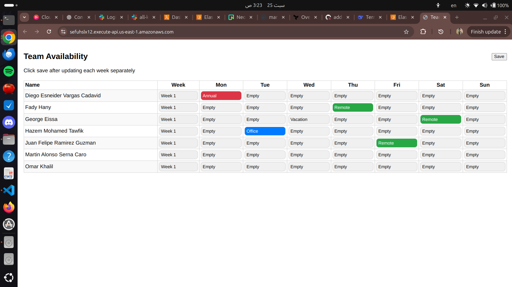

## 🛠️ TeamAvailTest – Employee Availability Tracker (Serverless & DevOps Project)
TeamAvailTest is a modern web application designed to track employee availability across the week, offering managers and teams a clear view of workforce availability. This project demonstrates end-to-end DevOps practices, cloud-native serverless deployment, and infrastructure as code using Terraform, showcasing advanced skills in AWS, Docker, and cloud engineering.

## Project Highlights
- Serverless deployment: Backend runs as a containerized AWS Lambda function using Docker

- External database integration: Connects to your existing PostgreSQL database with secure environment variables

- Infrastructure as Code: Terraform module to provision AWS resources including Lambda, ECR, and IAM roles

- Containerized application: Docker-based deployment with Lambda-compatible runtime

- Modular Terraform design: Clean, reusable infrastructure code with output-driven architecture

---
```
## Tech Stack & Key Features

| Layer                 | Technology / Service                                  |
|----------------------|--------------------------------------------------------|
| Backend              | Node.js, Express, AWS Lambda (containerized)           |
| Database             | PostgreSQL (external/your existing database)           |
| Cloud Provider       | AWS (Lambda, ECR, IAM, CloudWatch)                     |
| Infrastructure (IaC) | Terraform (modular structure)                          |
| Containerization     | Docker, Dockerfile                                     |
| Secrets Management   | Terraform variables (sensitive)                        |
```


---

### Key Features

- **Dynamic Availability Tracking**: Employee status management across the week.
- **Serverless Architecture**: Node.js backend runs as Lambda container image.
- **Scalable & Cost-efficient**: Pay-per-use Lambda pricing model.
- **Secure Database Connections**: Environment variable-based configuration.
- **Infrastructure as Code**: Reproducible deployments with Terraform.


## Architecture Overview
```
text
[Frontend Client] 
       ↓
[AWS Lambda (Docker Container)]
       ↓
[External PostgreSQL Database]
Project Structure
text
TeamavailTest/
├── server.js                 # Your Express application
├── package.json              # Node.js dependencies
├── Dockerfile                # Lambda container definition
└── terraform/                # Terraform module
    ├── main.tf               # Primary resource definitions
    ├── variables.tf          # Input variables
    ├── outputs.tf            # Output values (function URL)
    └── provider.tf           # AWS provider configuration
```
## Prerequisites
- AWS Account with appropriate permissions

- Terraform installed locally

- Docker installed locally

- Existing PostgreSQL database (external, Neon)

- Node.js and npm

## Quick Start
## 1. Clone the Repository
```
bash
git clone https://github.com/mariomafdyhabib/TeamavailTest.git
cd TeamavailTest
```
## 2. Prepare Your Application
Ensure your server.js is configured for Lambda:

- Export a handler function that takes event and context parameters

- Use environment variables for database configuration

## 3. Configure Database Connection
Update the Terraform variables with your database details:
```
bash
cd terraform
Create a terraform.tfvars file (add to .gitignore for security):

hcl
region = "us-east-1"
function_name = "teamavail-lambda"
database_host = "your-database-host"
database_user = "your-database-username"
database_password = "your-database-password"
```


## 4. Deploy Infrastructure
```
bash
# Initialize Terraform
terraform init

# Plan deployment
terraform plan

# Apply configuration
terraform apply
```
Terraform will:

- Create an ECR repository for your Docker image

- Build and push the Docker image to ECR

- Deploy the Lambda function with your database environment variables

- Create necessary IAM roles and permissions

- Output the Lambda Function URL

## 5. Access Your Application
After deployment, Terraform will output the Lambda Function URL:
```
text
lambda_function_url = "https://abcd1234.lambda-url.us-east-1.on.aws/"
```
Use this URL to access your application.



## Manual Docker Build (Optional)
```
bash
# Build the Docker image
docker build -t teamavail-lambda .

# Test locally (if your Lambda handler is configured for local testing)
docker run -p 9000:8080 teamavail-lambda
```
# Terraform Module Details
## Input Variables
- region: AWS region (default: us-east-1)

- function_name: Lambda function name

- database_host: External database hostname

- database_user: Database username

- database_password: Database password

## Outputs
- lambda_function_url: HTTP endpoint for your Lambda function

- ecr_repository_url: ECR repository URL for your Docker image

# Application Requirements
Your server.js should be structured for Lambda execution:
```

exports.handler = async (event, context) => {
    // Your application logic here
    return {
        statusCode: 200,
        headers: { "Content-Type": "application/json" },
        body: JSON.stringify({ message: "Hello from Lambda!" })
    };
};
```
## Security Notes
- Database credentials are stored as sensitive Terraform variables

- IAM roles follow principle of least privilege

- Consider using AWS Secrets Manager for production database credentials

- Use AWS_IAM authorization for Lambda Function URL in production

## Monitoring & Logging
- Lambda execution logs are available in AWS CloudWatch

- Monitor function metrics (invocations, errors, duration) in CloudWatch

- Set up CloudWatch alarms for error rates and throttling

## Clean Up
To destroy all created resources:
```
bash
git add .
git commit -am "destroy"
git push # run destroy pipeline
```
# Customization
## Modify Lambda Configuration
Edit terraform/main.tf to adjust:

- Memory size and timeout settings

- Environment variables

- VPC configuration (if needed)

## Add API Gateway
Extend the Terraform configuration to add API Gateway for advanced routing and authentication.

# Troubleshooting
## Common Issues
1. Docker build fails: Check your Dockerfile and ensure all files are in the correct paths

2. Lambda timeout: Increase the timeout value in Lambda configuration

3. Database connection issues: Verify database credentials and network accessibility

4. Permission errors: Check IAM role policies in AWS Console

## Debugging Steps
1. Check CloudWatch logs for Lambda execution errors

2. Verify environment variables in Lambda configuration

3. Test database connectivity from your local environment

4. Use terraform plan to preview changes before apply

## Future Enhancements
- Add CI/CD pipeline with GitHub Actions

- Implement API Gateway for advanced routing

- Add CloudFront distribution for caching

- Set up database connection pooling

- Add monitoring and alerting with CloudWatch

- Implement authentication and authorization

- Add frontend deployment to S3 + CloudFront

# Contributing
1- Fork the repository

2- Create a feature branch

3- Make your changes

4- Test Terraform deployment

5- Submit a pull request

## License
This project is open source and available under the MIT License.

## Support
For issues and questions:

- Create an issue in the GitHub repository

- Check Terraform and AWS documentation

- Review AWS Lambda container image guidelines
